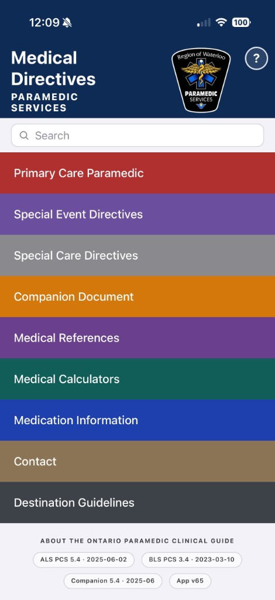
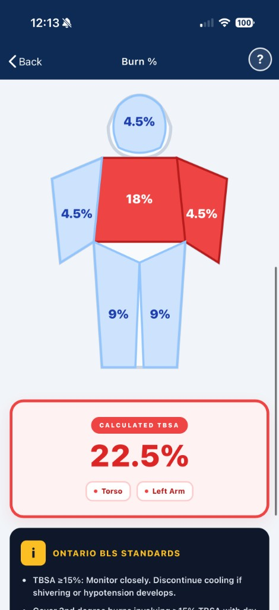
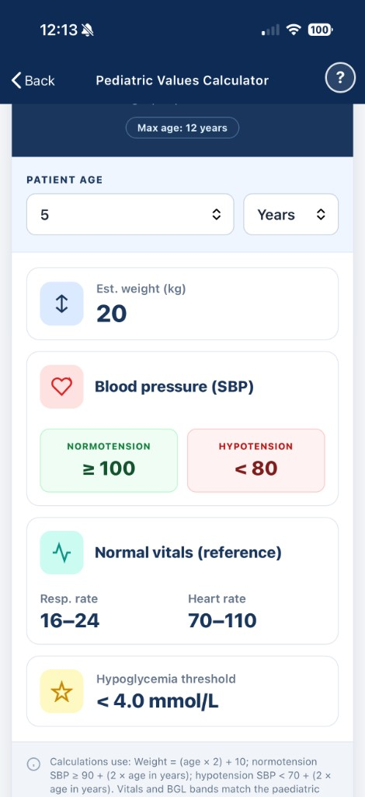
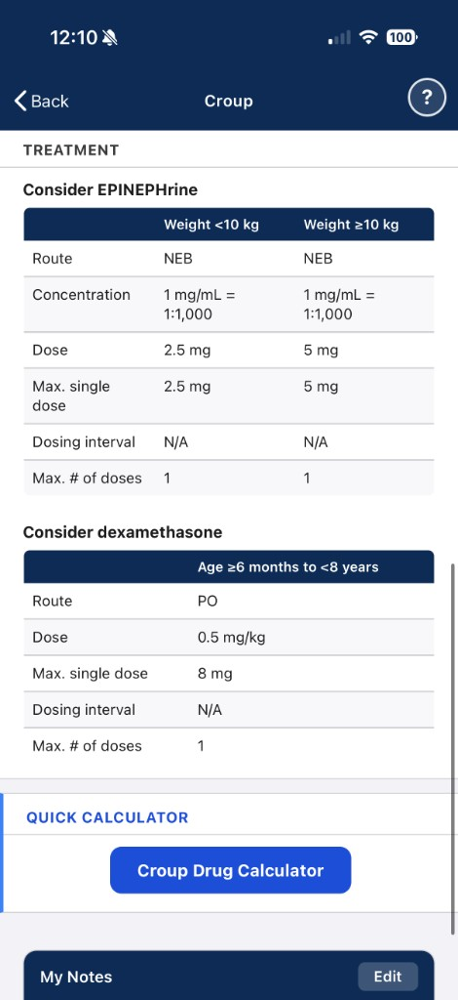
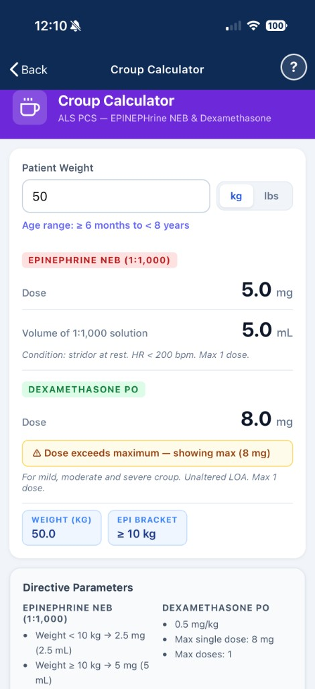

# Ontario Paramedic Clinical Guide (PCP Directives)

**Live app:** [https://icpryde.github.io/Primary-Care-Paramedic-Directives/](https://icpryde.github.io/Primary-Care-Paramedic-Directives/)

Progressive web app for Ontario paramedics: PCP directives, BLS standards, companion document, medical references, interactive calculators, medication lookup, destination guidelines, and more — optimized for phones and usable offline after the first load.

## Screenshots

<table>
<tr>
<td align="center" valign="top">
 
<b>Home</b> — navigation &amp; search
</td>
<td align="center" valign="top">
 
<b>Burn %</b> — Rule of Nines
</td>
<td align="center" valign="top">
 
<b>Pediatric values</b> — weight &amp; vitals
</td>
<td align="center" valign="top">
 
<b>Croup directive</b> — ALS PCS tables
</td>
<td align="center" valign="top">
 
<b>Croup calculator</b> — epi &amp; dexamethasone
</td>
</tr>
</table>

## Install (add to home screen)

For a full-screen shortcut that behaves like a native app:

### iPhone & iPad (Safari)

1. Open the app URL in Safari.
2. Tap **Share** → **Add to Home Screen** → **Add**.
3. Launch from the home screen icon. Remove an old icon first if it opens the wrong page.

### Android (Chrome)

1. Open the site in Chrome.
2. Tap **⋮** → **Install app** or **Add to Home screen**, then confirm.

**Samsung Internet:** Menu → **Add page to** → **Home screen**.

## Get the latest version

After updates are published, fully close the app and open it again so your device loads the newest files.

- **iPhone / iPad:** Swipe up from the bottom (or double-click Home), find the app in the app switcher, swipe it up to close, then reopen from the home screen.
- **Android:** Open Recents, swipe the app away, then reopen from the home screen or app list.

## Install iOS or Android app

Pre-built `.ipa` (iOS) and `.apk` (Android) files are available on the [Releases page](https://github.com/icpryde/Primary-Care-Paramedic-Directives/releases). These are automatically built and updated with every push to `main`.

- **iOS:** Download the `.ipa` file and sideload via AltStore, TrollStore, Signulous, or Xcode.
- **Android:** Download the `.apk` file and install directly on your device.

## Disclaimer

This project is provided as a convenience reference only and is considered beta software. It is not an official Ministry of Health, base hospital, employer, or paramedic service product, and nothing here should be treated as a substitute for the current Ontario ALS or BLS Patient Care Standards, the Companion Document, your service’s policies, medical direction, or other authoritative sources. Clinical standards, protocols, and drug information change over time, and errors or omissions may be present in this app or repository.

You are solely responsible for confirming any information before you rely on it in practice. The author and contributors offer no warranty, express or implied, regarding accuracy, completeness, or fitness for any particular purpose, and they assume no liability for any loss, injury, or other outcome arising from use of or reliance on this software or its content. Use is entirely at your own risk.
